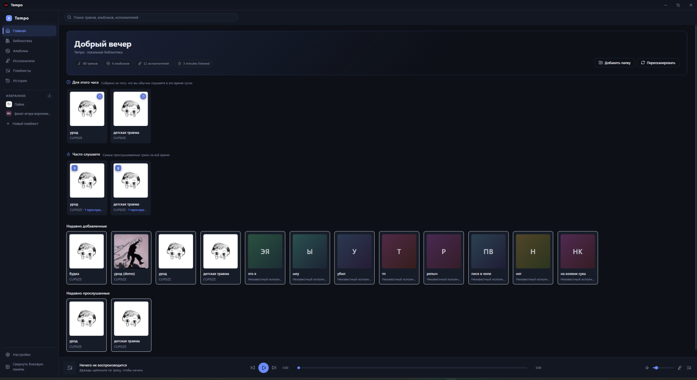

# 🎵 Tempo

**English** · [Русский](README.ru.md)

**A local-first desktop music player.** Your files, your library, no accounts, no cloud — everything works offline.

Built with **Tauri 2 + React 18 + TypeScript** on the frontend and **Rust + SQLite** under the hood. No Electron, no backend server, no telemetry.

     



## ✨ Features

- **Local library** — point Tempo at your music folders (MP3, FLAC, M4A, AAC, OGG, Opus, WAV) and it builds a browsable collection of albums, artists and tracks.
- **Fast incremental scanning** — files are parsed by tag (via `lofty`), album covers are extracted to the app data folder. Unchanged files (same size + mtime) are skipped, so rescans are near-instant. Scanning runs in Rust threads and never blocks the UI.
- **Full playback engine** — queue with shuffle, repeat (off / all / one), seek, volume; play counts and listening history are recorded automatically.
- **Playlists** — create, reorder, rename; add tracks from anywhere in the app.
- **Lyrics** — synced lyrics from embedded tags or `.lrc` files, with an online fallback and a distraction-free overlay.
- **SoundCloud provider** — search and stream from SoundCloud (HLS via `hls.js`) alongside your local library, through a unified provider abstraction.
- **Bilingual UI** — English and Russian out of the box.
- **Yours to style** — dark flat theme with customizable accent colors and an optional blurred background image.

## 🖥️ Screens

Home · Library · Albums · Artists · Playlists · History · Search · Settings — with a persistent player bar and queue panel.

## 🧱 Tech stack

| Layer | Tech |
|---|---|
| Shell | Tauri 2 (no Electron) |
| UI | React 18 + TypeScript (strict) + Vite 6, `lucide-react` icons, hand-rolled CSS (no framework) |
| Playback | HTML5 `<audio>` singleton + pure queue controller (shuffle permutation, repeat modes) |
| Backend | Rust: `rusqlite` (bundled SQLite, WAL mode), `walkdir`, `lofty`, `reqwest` |
| Data | Single SQLite file in the app data dir; ordered migrations tracked via `user_version` |
| Search | SQL `LIKE` queries across tracks / albums / artists, paged lists (500/page) |

## 🚀 Getting started

**Prerequisites:** [Node.js 18+](https://nodejs.org), [Rust](https://rustup.rs), and the [Tauri 2 prerequisites](https://tauri.app/start/prerequisites/) for your platform.

```bash
# install dependencies
npm install

# run in development mode
npm run tauri dev

# build a release installer (Windows: NSIS .exe)
npm run tauri build
```

The frontend can also be developed standalone (`npm run dev`) with Vite hot reload on port 1420.

## 📁 Project structure

```
src/                  # React frontend
  api/                #   typed wrappers over Tauri commands + event subscriptions
  components/         #   shared UI (track lists, covers, modals, player bar, queue)
  features/lyrics/    #   lyrics providers, LRC parsing, overlay
  pages/              #   Home, Library, Albums, Artists, Playlists, History, Search, Settings
  player/             #   playback engine: controller, queue, React bindings
  providers/          #   music source abstraction (local, SoundCloud)
  i18n/               #   EN / RU translations
src-tauri/            # Rust backend
  src/database.rs     #   SQLite layer + migrations
  src/scanner.rs      #   filesystem walk + incremental scan logic
  src/metadata.rs     #   tag & cover extraction (lofty)
  src/commands.rs     #   Tauri command surface (Result<T, String>)
```

The full architecture and module contracts are documented in [ARCHITECTURE.md](ARCHITECTURE.md).

## 🗺️ Status

`v0.1.0` — early alpha. Core playback, library scanning, playlists, lyrics and search are working. Expect rough edges.

## 📄 License

Not decided yet — see the repository discussion before redistributing.
