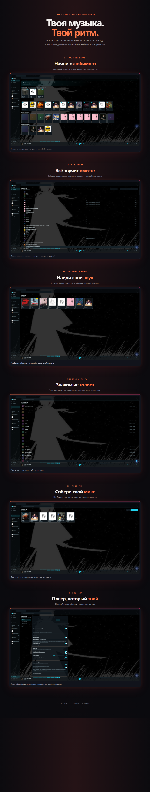

# Tempo

<p align="center">
  <strong>Вся музыка — в одном плеере.</strong><br>
  Локальная коллекция и музыка, которую вы находите в сети.
</p>

<p align="center">
  <a href="README.md">English</a> ·
  <a href="https://github.com/GLIPIYT/tempo-player/actions/workflows/ci.yml"></a> ·
  <a href="LICENSE">Лицензия MIT</a>
</p>

Tempo — локальный музыкальный плеер для Windows: он объединяет ваши файлы, SoundCloud и YouTube Music в одной библиотеке и очереди. Коллекция остаётся на компьютере, а музыка продолжает играть при переходе между страницами.

**[Скачать Tempo](https://github.com/GLIPIYT/tempo-player/releases)** · **[Сообщить о проблеме](https://github.com/GLIPIYT/tempo-player/issues)**

<p align="center">
  
</p>

## Вся музыка — в одном месте

| | |
|---|---|
| **Вся коллекция в одном месте** | Добавьте папки с MP3, FLAC, M4A, AAC, OGG, Opus и WAV. Tempo прочитает теги и обложки, а при следующих проверках найдёт только изменившиеся файлы. Треки можно скрывать, не перемещая и не удаляя их. |
| **Музыка всегда под рукой** | Ищите SoundCloud и YouTube Music рядом с локальной коллекцией. Собирайте очередь, включайте шаффл и повтор, настраивайте кроссфейд и громкость, меняйте скорость воспроизведения, регулируйте локальные и кэшированные треки пятиполосным эквалайзером, выбирайте волну или спектр. |
| **Плеер под себя** | Создавайте плейлисты, ставьте лайки, закрепляйте артистов и альбомы, включайте синхронизированные тексты. Выберите тему, фон, шрифт и вид плеера. |

Также есть плавающий мини-плеер, Discord Rich Presence, история прослушиваний, импорт и экспорт M3U8 и встроенное обновление приложения. Для локальной библиотеки не нужны аккаунт или облачный сервис.

## Запуск

Сейчас релизы Tempo — установщики NSIS для Windows. Чтобы собрать плеер из исходников, установите [Node.js 22](https://nodejs.org/), [Rust](https://rustup.rs/) и [зависимости Tauri](https://tauri.app/start/prerequisites/) для своей платформы.

```bash
git clone https://github.com/GLIPIYT/tempo-player.git
cd tempo-player
npm ci
npm run tauri dev
```

Собрать установщик Windows можно командой `npm run tauri build`. Для разработки только фронтенда запустите `npm run dev`; библиотека и воспроизведение требуют бэкенд Tauri.

## Как устроен проект

| Слой | Технологии |
|---|---|
| Десктоп | Tauri 2; React 18, TypeScript и Vite |
| Воспроизведение | Постоянный движок на HTML Audio, контроллер очереди и `hls.js` для SoundCloud |
| Нативное ядро | Команды Rust для сканирования, метаданных, сети и интеграций с системой |
| Хранение | SQLite с упорядоченными миграциями; музыкальные файлы остаются в исходных папках |
| Источники | Локальные файлы, SoundCloud и YouTube Music с общей моделью трека |

Фронтенд обращается к Rust через типизированные обёртки в `src/api/`. База данных и операции с файлами находятся в Rust; страницы и провайдеры React используют общие модели треков. Подробности — в [описании архитектуры](ARCHITECTURE.md).

## Проверки

```bash
npm run check
cargo test --manifest-path src-tauri/Cargo.toml
```

GitHub Actions запускает проверку типов, тесты и линтеры фронтенда, проверку порядка хуков, линтер workflow-файлов и Rust-тесты при push и pull request в `main`.

## О проекте

Tempo находится в альфа-версии (`0.8.3`) и в первую очередь ориентирован на Windows. Сейчас релизный workflow публикует установщик Windows. Сетевое подключение нужно онлайн-функциям и обновлятору; локальная библиотека не требует аккаунта или облачного сервиса.

[Релизы](https://github.com/GLIPIYT/tempo-player/releases) · [Обсуждения и ошибки](https://github.com/GLIPIYT/tempo-player/issues) · [Архитектура](ARCHITECTURE.md)

Лицензия [MIT](LICENSE).
