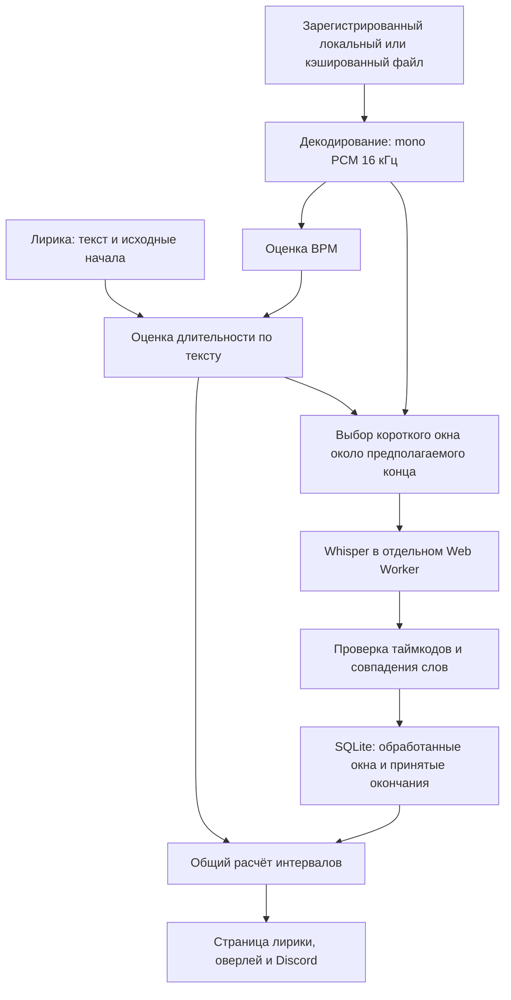

# Как Tempo использует Whisper и рассчитывает длительность лирики

Отчёт по реализации на 1 октября 2026 года. Код проверен на версии `c5ae5ff`; приведённые измерения взяты из ранее выполненных автоматических проверок. Новых измерений и ручных UI-тестов при подготовке этого отчёта не проводилось.

## 1. Краткое объяснение

В Tempo есть два уровня расчёта:

1. **Базовый:** оценивает конец строки по тексту, соседним таймингам и, если доступны подходящие данные, BPM. Он работает без Whisper.
2. **Углублённый:** локально распознаёт слова в коротких фрагментах существующего аудиофайла. Если конец распознанной фразы надёжно совпал с текстом лирики, уточняет окончание строки.

Whisper не создаёт всю синхронизацию с нуля, не переписывает исходные начала строк и не заменяет выбранного провайдера. Его задача — предложить конец уже известной строки. Ручные и точные исходные окончания имеют приоритет.

В текущей реализации **нет отдельного детектора вокала, отделения голоса от инструментов или сравнения звуковых паттернов последних пяти секунд**. Сравниваются распознанные слова и слова выбранной лирики. Это отличие от первоначальной идеи важно учитывать.

## 2. Общая схема



Без принятого результата распознавания остаётся текстовая оценка. Пустой результат или тишина сами по себе не доказывают окончание вокала.

## 3. Какая модель подключена

| Параметр | Реализация |
| --- | --- |
| Модель | `onnx-community/whisper-tiny_timestamped` |
| Ревизия | `517244293732ee2d58139af5814231b7e6830a0d` |
| Размер и формат | Multilingual tiny, квантование `q8` |
| Обвязка | Transformers.js `3.8.1` |
| Движок | ONNX Runtime Web `1.22.0-dev.20250409-89f8206ba4` |
| Исполнение | WASM внутри отдельного Web Worker |
| Файлы модели | 7 файлов, 43 596 876 байт — около 41,58 MiB |
| Локальная пара движка `.mjs`/`.wasm` | 21 640 503 байта — около 20,64 MiB |

Выбран экспорт с поддержкой времён слов. Модель и её ревизия зафиксированы; каждый файл проверяется по размеру и SHA-256. Подмена недостающей модели другой удалённой моделью запрещена.

Модель автоматически загружается, когда разрешён анализ и появляется подходящая работа. Движок подготавливается перед dev/build и поставляется локально. При наличии проверенных файлов повторное распознавание использует их без повторной загрузки модели.

Распознавание выполняется на компьютере пользователя. Модуль Whisper не отправляет аудиофрагменты на сервер OpenAI или Hugging Face; внешний запрос нужен для загрузки файлов модели. Ключ OpenAI и платный вызов ASR API не используются. Это не означает, что весь плеер работает без сети: поиск лирики у провайдеров и передача текущей строки в Discord — отдельные функции.

**Текущее распознавание выполняется на CPU через WASM. Видеокарта для него не используется.** Проверка видеопамяти — условие первоначального автоматического включения, выбранное по запросу пользователя, а не требование используемого GPU backend.

`numThreads=1` ограничивает настройки WASM/ORT. Это не обещание одного потока ОС для всего плеера: декодирование, браузер, JIT и другие процессы WebView могут работать параллельно.

## 4. Когда разрешён углублённый анализ

Настройка находится в «О программе» и называется **«Углубленное анализирование лирики»**.

При отсутствии сохранённого выбора автоматическое включение разрешается только при выполнении всех условий:

- установлено не менее 16 GiB оперативной памяти;
- есть не менее 6 физических CPU-ядер, а не логических потоков;
- у одного аппаратного GPU есть не менее 2 GiB выделенной видеопамяти.

Память нескольких видеокарт не суммируется; общая системная память встроенной графики не считается выделенной VRAM. Если хотя бы одно значение неизвестно или ниже порога, автоматическое включение не рекомендуется. Ручной выбор пользователя имеет приоритет и сохраняется.

Само включение настройки не запускает обход всей медиатеки. Для новой работы нужны текущий трек, воспроизведение, синхронизированная лирика с пригодными строками и доступный локальный файл. Если все непустые строки уже имеют точные окончания, лишнее распознавание не требуется.

## 5. Как подготавливается аудио

Whisper получает аудио только из существующего файла зарегистрированного трека:

- локального файла;
- уже доступного локального кэша SoundCloud или YouTube.

Анализ не скачивает незакэшированный поток специально ради распознавания. После обычного завершения кэширования текущего SoundCloud-трека ограниченная проверка доступности позволяет подключить анализ без повторного выбора песни.

Перед декодированием действуют ограничения:

| Проверка | Предел |
| --- | --- |
| Размер исходного файла | 64 MiB |
| Длительность | 600 секунд |
| Консервативная оценка исходного декодированного PCM | 256 MiB |
| Неизвестные необходимые параметры аудио | Новая обработка не запускается |

Декодируется **весь допустимый текущий файл**, после чего каналы усредняются и звук преобразуется в mono Float32 PCM с частотой 16 кГц. Whisper затем получает короткие копии участков этого буфера. Усреднение каналов не отделяет вокал от фоновой музыки.

Полный mono PCM удерживается только для текущей работы в памяти, не записывается в SQLite. После освобождения буфера новое незавершённое окно может потребовать повторного декодирования; сохранённые окна заново распознавать не нужно.

## 6. Как выбираются фрагменты для Whisper

Сначала базовый алгоритм вычисляет предполагаемый конец строки `E`. Обычное окно планировщика:

```text
начало окна = E − 6 секунд
конец окна  = E + 1 секунда
```

Границы округляются наружу с шагом 20 мс и обрезаются по границам трека. Получается около 7 секунд, до примерно 7,04 секунды из-за округления. Протокол Worker допускает максимум 12 секунд; это защитный потолок, а не обычный размер окна. В диагностике песни использовались отдельные 12-секундные образцы.

Приоритет получает текущая строка, затем строки с ближайшим началом к позиции воспроизведения. Уже покрытые кэшем окна, принятые окончания и ручные/точные исходные окончания пропускаются.

Это обработка файла, а не непрерывное прослушивание микрофона или ровно последних пяти секунд проигрывания. Окно может включать ещё не проигранный участок локального файла. Из-за пауз планировщика полный анализ песни за одно прослушивание не гарантируется.

## 7. Что именно делает Whisper

Pipeline вызывается с `task: 'transcribe'` и `return_timestamps: 'word'`. Текст выбранной лирики не подаётся в модель как prompt. На выходе ожидаются слова с началом и концом:

```text
слово → начало в секундах → конец в секундах
```

Тайминги внутри окна переводятся в исходные секунды музыкального файла.

Язык выбирается эвристикой текста, а не анализом языка звука:

- полностью русские буквы → `ru`;
- полностью ASCII-латинские буквы → `en`;
- слишком короткий, смешанный или неподдерживаемый текст пропускается.

Нужно не менее 10 букв и двух содержательных токенов. Поэтому сейчас нельзя обещать полноценное автоматическое определение всех языков: например, латинский текст другого языка может быть ошибочно направлен как английский.

Результат строго проверяется. Некорректные числа, отсутствующие времена, нулевая длительность, пересечения или выход за границы окна приводят к отклонению всей последовательности слов. Предполагаемое окончание по такому результату не устанавливается.

## 8. Как распознанные слова уточняют строку

Matcher нормализует слова: нижний регистр, `ё → е`, выделение буквенных/числовых токенов. Затем ищет совпавший **суффикс**, то есть окончание текста строки, среди распознанных слов около её исходного начала.

Для принятия нужны:

- текстовое совпадение с оценкой не ниже 0,8;
- минимум два содержательных совпавших токена;
- единственный подходящий кандидат;
- отсутствие лишних распознанных слов внутри строки;
- отсутствие неоднозначных повторов;
- отступ от границ распознанного окна не менее 180 мс.

Полностью одинаковые строки, например повторяющийся припев, не используются для этого уточнения. Это уменьшает шанс привязать слова не к тому повторению, но уменьшает число строк, для которых ASR сможет помочь.

Оценка совпадения:

```text
confidence = совпавшие токены / max(токены строки, распознанные соседние токены)
```

Это **оценка совпадения текста**, а не вероятность корректности, выданная Whisper.

Если кандидат принят, конец последнего совпавшего слова становится предложенным окончанием строки. Исходное начало строки не переносится. Без надёжного совпадения сохраняется базовая оценка.

## 9. Как работает базовый расчёт без Whisper

### Текст

Для каждой строки учитываются слова, приблизительные слоги по гласным, пунктуация и признаки растягивания букв. Объём фразы:

```text
units = max(1, 0,45 × количество слов + 0,55 × приблизительное количество слогов)
```

Для русских слов подсчитываются гласные; для латинских — группы гласных. Для остальных письменностей применяется грубая оценка длины, с меньшей уверенностью.

### Соседние строки

Из соседних промежутков оценивается местная скорость исполнения. Нужны минимум три подходящих примера; большие паузы, пустые/одновременные строки и слишком отличающийся объём текста не используются. Это позволяет учитывать более быстрое или медленное исполнение конкретной песни.

Без местной калибровки используется базовая скорость около 2,6 условных единиц в секунду. К оценке добавляются 0,45 секунды и небольшие поправки на пунктуацию/растягивание. Расчётная длительность ограничена диапазоном 1,2–30 секунд, затем доступным интервалом до следующего начала/конца файла. Известное начало последнего слова также не позволяет закончить фразу раньше него.

Если оставшийся промежуток заметный — не менее 0,75 секунды и 20% исходного промежутка, — он выделяется как участок без текста. Это вычисленная пауза, а не акустическое доказательство отсутствия вокала.

### BPM

BPM считается отдельно от Whisper: на трёх коротких участках анализируются положительные изменения RMS и их периодичность. Проверяются согласованность оценок и неоднозначность половинного/двойного темпа.

Влияние BPM намеренно небольшое: он применяется только при отсутствии местной текстовой калибровки и уверенности не ниже 0,8. В текущей формуле базовая скорость меняется максимум примерно на ±1,5%. Низкоуверенный BPM не влияет на длительность. BPM не позволяет однозначно узнать длительность пропетой фразы.

## 10. Приоритеты и стабильность отображения

Порядок выбора окончания:

1. Ручной конец или валидный точный исходный конец, включая конец последнего слова.
2. Принятый конец по распознанным словам.
3. Текстовая оценка, местный темп и слабая поправка BPM.

Ручные значения сохраняются; визуальная активность строки всё равно учитывает переход к следующей строке и фактический конец файла.

Страница лирики, оверлей и Discord используют общий расчёт. Начавшийся интервал фиксируется на текущий проход: поздний ASR-результат не должен откатить заливку или резко изменить уже показанную строку. Будущие интервалы могут уточняться. Перемотка назад начинает новый проход с актуальными оценками.

Все времена относятся к исходному аудио. При скорости 1,5× не нужно отдельно умножать LRC-тайминги: используется позиция в музыкальном файле.

## 11. Что хранится в кэше

SQLite хранит компактный анализ:

- идентичность аудиофайла и версии алгоритма/модели;
- BPM и его уверенность;
- завершённые окна;
- распознанные слова с временами;
- принятые окончания для конкретного источника лирики.

Завершённое окно с пустым результатом тоже сохраняется. Это предотвращает бесконечное повторение одной неудачной попытки. При изменении версии модели ASR-данные пересчитываются по правилам версионирования.

Идентичность файла учитывает путь, размер, точную дату изменения и нативный идентификатор файла. Это не полное хеширование всего звука при каждом обновлении позиции.

Ключ лирики учитывает провайдера и полный исходный результат. Для длинных данных используется компактный SHA-256, а прежние короткие ключи сохранены для совместимости. Изменение пользовательского смещения не меняет исходный ключ.

Пример сохранения смещения:

```text
Исходное начало: 17 с
Смещение: −5 с
Распознанный конец в аудио: 14 с
Сохранённый исходный конец: 14 − (−5) = 19 с
Отображаемый интервал: 12–14 с

Новое смещение: −4 с
Новый интервал: 13–15 с
```

Так смещение не применяется дважды. Другой вариант лирики может сопоставляться с уже сохранёнными словами без повторного запуска Whisper.

## 12. Фоновая нагрузка и отключение

Планировщик работает только с текущим треком и разделяет очередь анализа с измерением громкости. Учитываются фактическое время декодирования, BPM, инициализации и распознавания. После работы начисляется примерно девятикратная пауза:

```text
2 секунды работы → около 18 секунд ожидания
```

Неоплаченная пауза сохраняется при перемотке, смене провайдера и отмене. Это бюджет времени активности, **не фиксированный предел CPU в диспетчере задач**. Отдельная короткая операция может дать заметный всплеск.

При паузе новые задания не назначаются, но уже начавшееся распознавание не обязательно прерывается немедленно. Worker и PCM освобождаются после 60 секунд простоя при отсутствии выполняющейся работы; при занятом Worker проверка освобождения переносится. Завершение всех подходящих окон также освобождает ресурсы.

При выключении настройки прекращается расписание и отменяется Worker, затем нативный менеджер отменяет загрузку и удаляет только проверенную папку текущей ревизии модели. Поставляемый с приложением движок WASM не удаляется. Сохранённый компактный анализ остаётся и может использоваться без установленной модели.

Встроенный браузерный `decodeAudioData` нельзя мгновенно остановить. Если отключение пришлось на декодирование, очередь удерживается до его завершения, а результат отменённой работы не применяется.

## 13. Что подтвердили реальные проверки

Проверки выполнялись на Windows WebView2 `154.0.4258.37`, с отдельными базой/профилем/кэшем и настоящими нативными URL файлов. Проверялась также собранная версия со встроенным фронтендом, без Vite.

| Проверка | Наблюдение |
| --- | --- |
| Английская речь, первый нативный Worker | 22 слова с таймингами, около 2,782 с распознавания |
| Русская речь, тот же Worker | 12 слов с таймингами, около 1,845 с |
| Инициализация первого нативного Worker | Около 2,672 с |
| Новый процесс собранного приложения | Локальная модель и три checkpoints сохранились; EN 22 слова / 2,702 с, RU 12 / 1,941 с |
| Работа настоящего планировщика | 6,350 с активности за 65,059 с, то есть 9,761% времени |
| Повторный запуск планировщика | Три окна восстановлены без нового decode/Worker/распознавания |
| Пик суммарного working set процессов WebView | Около 1 205 MiB при исходных 397 MiB |
| Через 1,5 с после освобождения Worker | Около 606 MiB working set |

Русский образец — синтез Microsoft Irina, не пение. В распознавании были ошибки окончаний слов. Результаты английской и русской речи не доказывают точность вокальных таймингов.

На **трёх непустых 12-секундных окнах одной песни** получено ноль пригодных последовательностей времён и ноль принятых окончаний. Окна были выбраны около строк в разных частях песни, а не под успешный результат. Они не были тихими: RMS примерно 0,398 / 0,388 / 0,388.

Модель генерировала текст, но вместе с повторениями и некорректными временами: нулевая длительность, отсутствующие таймкоды и выход за окно. Валидатор отклонил результаты. Время трёх попыток — примерно 11,774 / 11,412 / 1,612 секунды. В этих случаях остаётся базовый расчёт.

**Точность распознавания пения этой моделью не подтверждена.** Успешная речь не означает успешную обработку песни с инструментами и эффектами.

Измерения памяти охватывают группу процессов WebView, могут повторно учитывать общие страницы и пропускать короткие пики между отсчётами. Это не точная память одного Worker. Размер модели около 42 MiB на диске не означает 42 MiB RAM. Точная пиковая внутренняя память браузерного декодера не измерена.

При возобновлении собранного приложения модель использовалась локально с проверенным процессным запретом внешнего доступа. Это не проверка системного отключения интернета или релизного установщика. Отмена нативной загрузки и распознавания, удаление только изолированной папки и сохранение checkpoints также проверены автоматически.

## 14. Что сейчас нельзя обещать

- Точное окончание каждой спетой строки.
- Полноценный VAD, определение начала/конца вокала и отделение голоса.
- Сравнение акустических паттернов последних пяти секунд.
- Генерацию синхронизированной лирики из обычного plain text без исходных начал.
- Надёжное автоматическое определение всех языков.
- Использование GPU или жёсткий предел общего CPU/RAM.
- Полный анализ песни за одно прослушивание.
- Проверенный вручную внешний вид, плавность и отсутствие помех при прослушивании.

Практический вывод: базовый алгоритм длительности уже используется, а Whisper — дополнительный, консервативно проверяемый источник. Его нынешний вклад в пение требует дальнейшего подтверждения; ошибочные ASR-данные не должны заменять более надёжные исходные тайминги.

## 15. Что проверить пользователю

1. Короткую строку перед длинным проигрышем, плотную длинную фразу и последнюю строку песни.
2. Ручные окончания: они не должны заменяться автоматическим расчётом.
3. Смену провайдера, положительное/отрицательное смещение, перемотку вперёд и назад.
4. Скорости 0,5×–2× и совпадение текущих строк страницы, оверлея и Discord.
5. Включение/отключение настройки во время загрузки или работы, сохранение выбора после перезапуска.
6. Слышимость и отзывчивость при проигрывании незакэшированного SoundCloud, а затем при готовности обычного кэша.
7. Нагрузку на своём компьютере: короткие всплески, среднюю загрузку и память после паузы/отключения.

## Исходники и происхождение данных

- [Модель, пределы и типы данных](../../src/features/lyrics/analysis/contract.ts).
- [Запуск Whisper](../../src/features/lyrics/analysis/asr.worker.ts) и [проверка времён слов](../../src/features/lyrics/analysis/workerProtocol.ts).
- [Планировщик и checkpoints](../../src/features/lyrics/analysis/runner.ts).
- [Сопоставление текста](../../src/features/lyrics/analysis/matchWords.ts).
- [Текстовый расчёт](../../src/features/lyrics/timingResolver.ts) и [стабилизация прохода](../../src/features/lyrics/playbackTiming.ts).
- [Декодирование](../../src/audio/decodeForAnalysis.ts) и [BPM](../../src/audio/bpm.ts).
- [Нативная модель и кэш](../../src-tauri/src/lyric_analysis.rs), [проверка оборудования](../../src-tauri/src/hardware.rs).
- [Исходный отчёт автоматических измерений](local-lyrics-analysis.md).

Graphify использован для первоначальной навигации. Его существующий граф не отражает новые модули ASR полностью, поэтому описание новой реализации сверено непосредственно с актуальными исходниками. Контекст запроса графа ограничивался 1 500 токенами; это лимит вывода, а не измеренная стоимость генерации.
